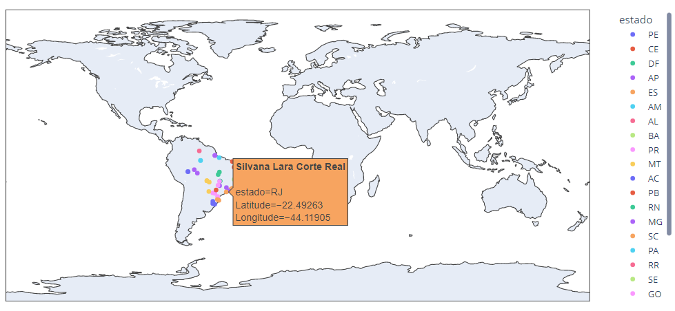

# Coordenadas

# Sobre
Recebe um arquivo CSV e retorna outro acrescentando colunas com as coordendas geográficas (Latitude e Longitude). Também há a plotagem das localizações em mapa dinãmico. 
Obs.: Os dados aqui presentes foram obtidos via site gerador de dados fake.

Status do projeto: :heavy_check_mark: Concluído

# Índice
:small_blue_diamond: [Desafios](#desafios)

:small_blue_diamond: [Principais características](#principais-características)

:small_blue_diamond: [Pré-requisitos](#pré-requisitos)

:small_blue_diamond: [Mapa Plotly](#mapa-plotly)

:small_blue_diamond: [Autor](#autor)

:small_blue_diamond: [Contribuições futuras](#contribuições-futuras)

# Desafios
Obter as coordenadas geográficas a partir de endereços disponibilizados em uma base de dados. O intuito é conseguir identificar a localização exata de pessoas ou ornanizações em um mapa. Este projeto termina com esta devida plotagem usando códigos em Python, mas pode ser interessante esta visualização em algum outro software, como o Power BI que permite a criação de Tooltips de forma dinâmica.

# Principais características
- Tratamento da coluna informando cep para deixar em formato padronizado do Brasil (xxxxx-xxx);
- Caso o endereço não seja encontrado (pode ocorrer por erro de digitação no cadastro rua, por exemplo), as colunas de "Latitude" e "Longitude" recebem o texto "Erro";
- O programa calcula o tempo de execução. Por meio de testes, vimos que uma requisição para uma localidade demora entre 0.6 a 1.1 segundo para encontrar suas coordenadas geográficas. Se tratando uma base de dados grande, esse código pode se tornar lento;
- É possível encontrar endereços internacionais. É aconselhável não informar a coluna de cep (código postal) nesses casos e acrescentar a coluna de país na requisição;

# Pré-requisitos
Para conseguir rodar todo o programa, verifique se os seguintes pacotes já estão instalados na sua máquina:

- [Pandas](https://pandas.pydata.org/)
- [Requests](https://requests.readthedocs.io/en/latest/)
- [Time](https://docs.python.org/3/library/time.html)
- [Re](https://docs.python.org/3/library/re.html)
- [Geopy](https://pypi.org/project/geopy)
- [Plotly](https://plotly.com/python)

# Mapa Plotly
Como exemplo de mapa gerado a partir desse projeto, deixo aqui um print:

# Autor

[ Bruno Cavalcanti Santos](https://github.com/BrunoSantos14)
    
# Contribuições futuras
Qualquer dúvida ou ideias para melhorias do projeto, podem me contactar por email: bruno.canti.santos@gmail.com
